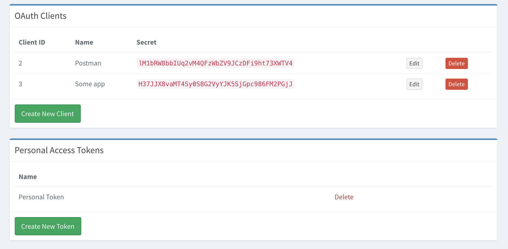
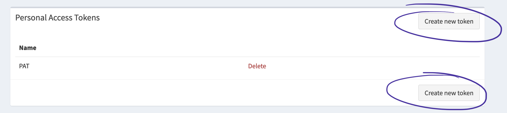
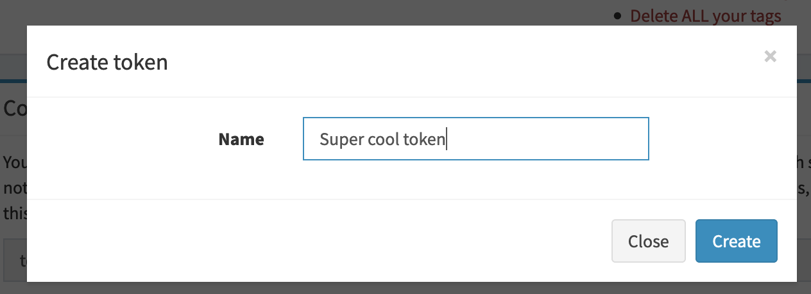
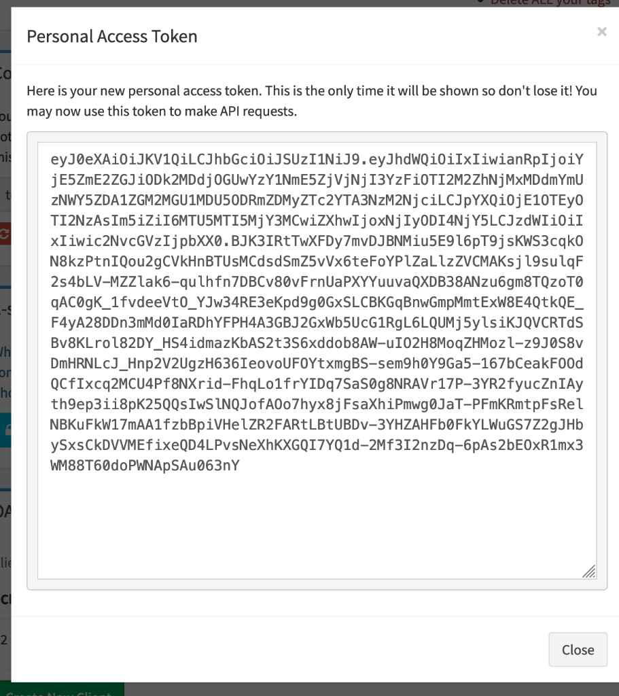

# Autenticación

La API de Firefly III utiliza el flujo de trabajo **OAuth2** para garantizar un acceso seguro. A continuación, se describen los dos métodos principales para autenticar tus aplicaciones: Tokens de Acceso Personal y Clientes OAuth2.



---

## Tokens de Acceso Personal (PAT)

Un poco de contexto técnico. Si tu aplicación no puede o no quiere usar el flujo completo de OAuth2, la forma más sencilla de autenticarte es generar un **Token de Acceso Personal** (PAT, por sus siglas en inglés).

Puedes generar tu propio PAT desde tu página de perfil.

1.  Inicia sesión en tu instancia de Firefly III.
2.  Ve a **Opciones > Perfil > OAuth**.
3.  Busca la sección "Tokens de Acceso Personal" y haz clic en **"Crear nuevo token"**.



4.  Dale a tu token un nombre que reconozcas fácilmente, como "Mi super token".



5.  Haz clic en "Crear". Se generará tu token. **Copia el token completo y guárdalo en un lugar seguro**. Solo se mostrará esta vez. ¡Sí, es muy largo!



Una vez que tengas tu PAT, debes incluirlo en los encabezados de tus solicitudes a la API de la siguiente manera:

```http
Authorization: Bearer <TU_TOKEN_DE_ACCESO_PERSONAL>
```

## Clientes OAuth2

Este es el método estándar y más seguro, ideal para aplicaciones de terceros que interactúan con los datos de un usuario.

1. Crear un Cliente OAuth2
Desde la misma página de OAuth, haz clic en "Crear Nuevo Cliente" para iniciar el proceso.

2. Configurar el Cliente
Dale un nombre descriptivo a tu cliente e ingresa la URL de redirección (callback) correcta. Esta es la URL a la que Firefly III enviará al usuario después de que autorice tu aplicación.

Si todo va bien, aparecerá una nueva entrada en la lista. Esta mostrará un ID de Cliente y un Secreto. El secreto se puede intercambiar por un token de acceso, el cual se utiliza para acceder a la API en nombre del usuario.

## Clientes No Confidenciales
Algunos clientes, como el importador de datos, son aplicaciones del lado del cliente (como una aplicación JavaScript) y no pueden guardar un "secreto" de forma segura.

Para estos casos, al crear el cliente, debes desmarcar la casilla "confidencial". Esto generará un cliente que solo tiene un ID de Cliente, sin un secreto. Este tipo de cliente utiliza un flujo de autorización diferente (PKCE) adecuado para aplicaciones públicas.

Para el importador de datos oficial de Firefly III, es necesario crear un cliente no confidencial desmarcando esta casilla. Para la mayoría de las demás integraciones, querrás mantener el cliente como confidencial.
