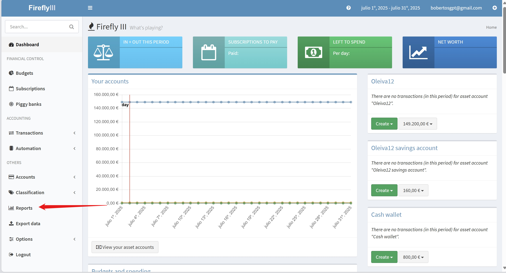

<figure markdown="span">

</figure>

<strong>
    <h1 align="center">Firefly III - Manual de Usuario</h1>
</strong>

Bienvenido al manual de usuario para la exportación de reportes en Firefly III. Este manual te guiará a través de los diferentes tipos de reportes que puedes generar y exportar desde la aplicación, así como los formatos disponibles para la exportación.

## Dónde encontrar los reportes

Los reportes en Firefly III se pueden encontrar en la sección de "Reports" en la barra lateral izquierda. Desde allí, puedes acceder a diferentes tipos de reportes que te ayudarán a analizar tus finanzas personales.

## Exportación de Reportes

Los reportes en Firefly III pueden ser exportados en dos **formatos principales: PDF y XLS**. Estos reportes te permiten analizar tus finanzas de manera efectiva y compartirlos con otros si es necesario.

Dentro de la sección de reportes, encontrarás otras subsecciones que contienen las diferentes opciones para generar y exportar reportes. Algunas de estas subsecciones con sus respectivas opciones son:

- **Reports**: Aquí puedes seleccionar el tipo de reporte que deseas generar. Las opciones incluyen:
    - **Report Type**: Selecciona el tipo de reporte que deseas exportar.
        - **Default Financial Report**: Un reporte financiero predeterminado que incluye un resumen de tus finanzas.
        - **Transaction History Overview (audit)**: Un reporte detallado del historial de transacciones
        - **Budget Report**: Un reporte que muestra el estado de tu presupuesto.
        - **Category Report**: Un reporte que muestra las categorías de tus transacciones.
        - **Tag Report**: Un reporte que muestra las etiquetas de tus transacciones.
    - **Included accounts:** Selecciona las cuentas (por ejemplo, Cuentas de Ahorro, Cuentas Corrientes, etc.) que deseas incluir en el reporte.
    - **Date Range**: Define el rango de fechas para el reporte.
    - **Pre-set ranges**: Puedes seleccionar rangos predefinidos como el año actual o los últimos 3 meses.

- **Extra Options**: Aquí puedes ajustar opciones adicionales para la exportación del reporte.

    !!! info "Nota Importante"
        Cada tipo de reporte puede tener opciones específicas adicionales. Por ejemplo, el reporte Budget te permite seleccionar el presupuesto que deseas incluir, mientras que el reporte de Categorías te permite elegir las categorías específicas a incluir en el reporte.

- **View Report**: Aquí encontrarás el botón para generar y ver el reporte. Una vez que hayas configurado todas las opciones, haz clic en "Submit" para generar el reporte.

- **Quick Links**: En la parte superior derecha de la página, encontrarás enlaces rápidos para acceder a los reportes más utilizados, como el reporte financiero predeterminado, el historial de transacciones, el reporte de presupuesto, entre otros.

Para aprender a exportar cada uno de los tipos de reportes disponibles, consulta la sección específica del tipo de reporte que desees exportar:

- [Default Financial Report](reports/default.md)
- [Transaction History Overview (audit)](reports/transaction_history.md)
- [Budget Report](reports/budget.md)
- [Category Report](reports/category.md)
- [Tag Report](reports/tag.md)

!!! info "Información Adicional"
    Si quieres obtener más información sobre cómo funciona la exportación de reportes en Firefly III, puedes consultar el [Manual Técnico](../manual_tecnico/introduccion.md) que proporciona detalles sobre la arquitectura del sistema, la API REST y otros aspectos técnicos.
