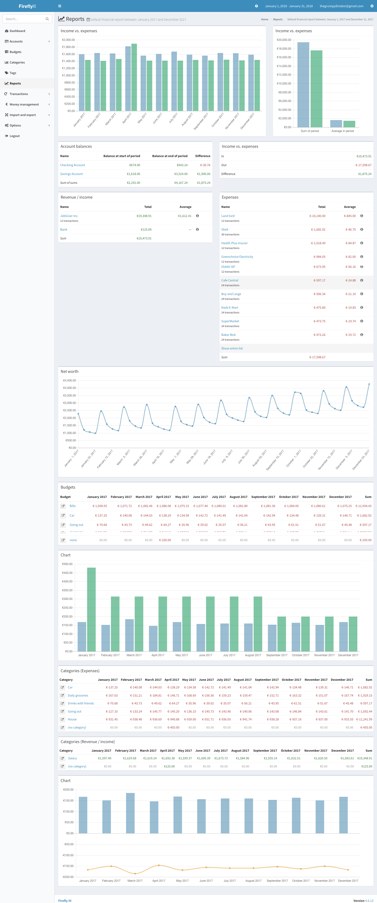
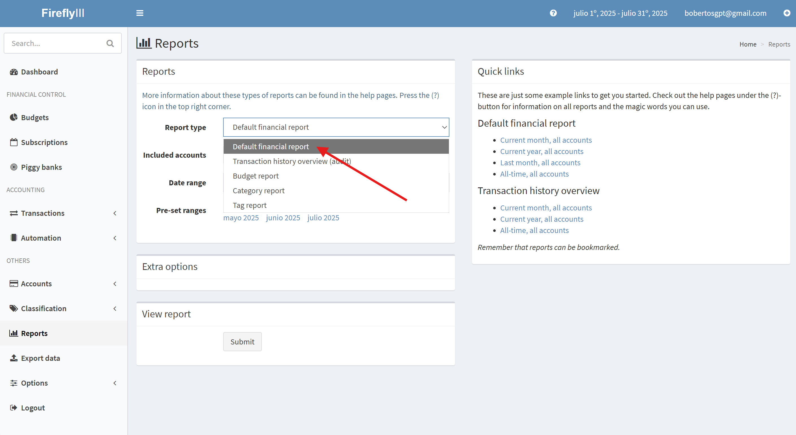
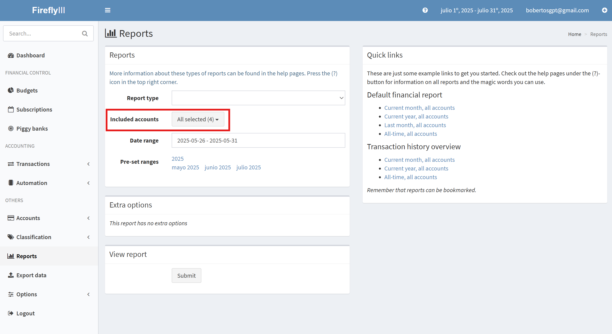
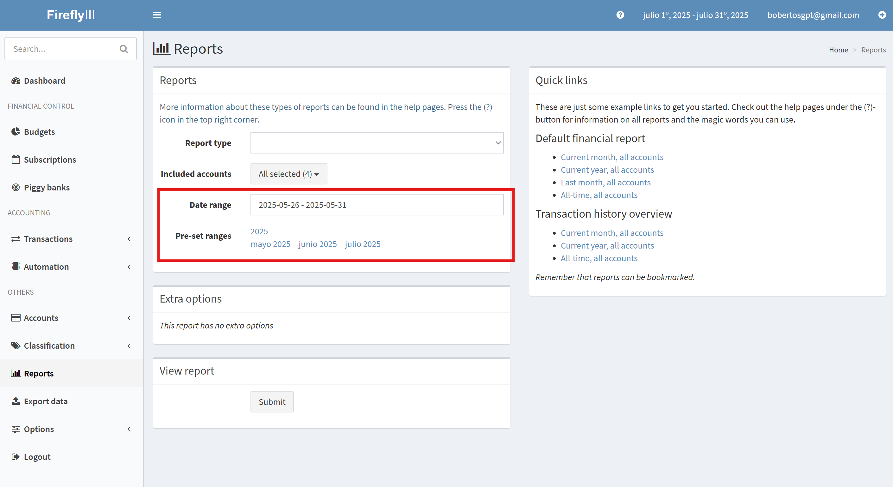
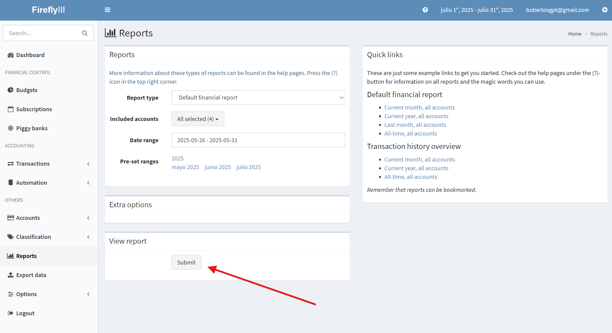
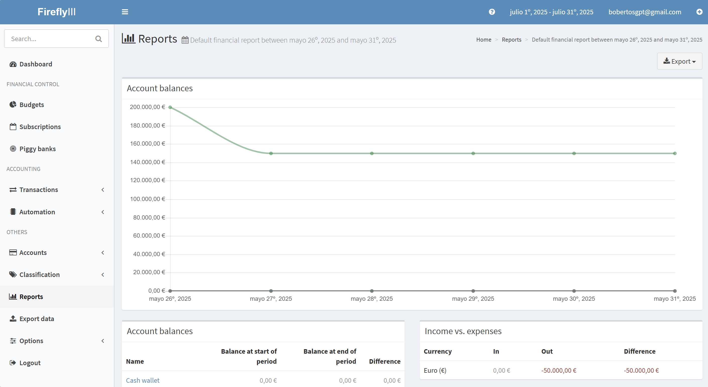
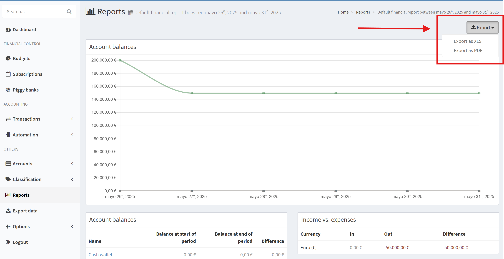

# Default Financial Report

## Descripción General

El informe predeterminado le ofrece una visión general de sus finanzas. Muestra los saldos de sus cuentas con resúmenes, además de sus gastos e ingresos. También incluye sus presupuestos, categorías y suscripciones, lo que le brinda una visión general de su situación financiera actual. Puede hacer clic en la captura de pantalla a continuación para ver una versión ampliada.

Cada tabla que ve en la captura de pantalla se puede ordenar por nombre, por importe, en orden inverso, etc. Los gráficos tienen pequeños textos al pasar el ratón para mayor claridad y los botones (`i`) le mostrarán información más detallada.

## Cómo generar el reporte

Para generar un reporte, primero debes acceder acceder a la sección "Reports" en el menú lateral izquierdo de Firefly III. Una vez allí, sigue los siguientes pasos que se te mostran a continuación.

### Configuración antes de generar el reporte

1. En la sección "Reports", presiona el menú desplegable "Report Type" y elige "Default Financial Report".

    

2. Selecciona la cuenta que deseas analizar en el menú desplegable "Included accounts". Si no seleccionas una cuenta, se mostrarán todas las cuentas por defecto.

    

3. Selecciona el período que deseas analizar en el menú desplegable "Date Range" o puedes escoger una de las opciones de "Preset-set ranges".

    

4. Cuando hayas especificado todos los filtros para generar el reporte según tus necesidades, presiona el botón "Submit" en la sub-sección "View Report".

    

    !!! info "Información"
        Esta imagen solo es con fines ilustrativos para mostrar la ubicación del botón Submit. El tipo de reporte que se está explicando para exportar podría no coincidir con el de la imagen.

### Visualización y exportación del reporte

1. Una vez que hayas presionado el botón "Submit", se generará el reporte y podrás ver los resultados.

    

2. Parea exportar el reporte, puedes hacer clic en el botón "Export" que se encuentra en la parte superior derecha de la página. Esto te permitirá descargar el reporte en formato PDF o XLS.

    

    !!! info "Información"
        Esta imagen solo es con fines ilustrativos para mostrar la ubicación del botón de exportación. El tipo de reporte que se está explicando para exportar podría no coincidir con el de la imagen.

4. Una vez hayas seleccionado el tipo de archivo (PDF o XLS) que deseas para exportar el reporte, se descargará automáticamente en tu dispositivo.

!!! success "¡Listo!"
    Ahora has generado y exportado con éxito el reporte **Default Financial Report**.